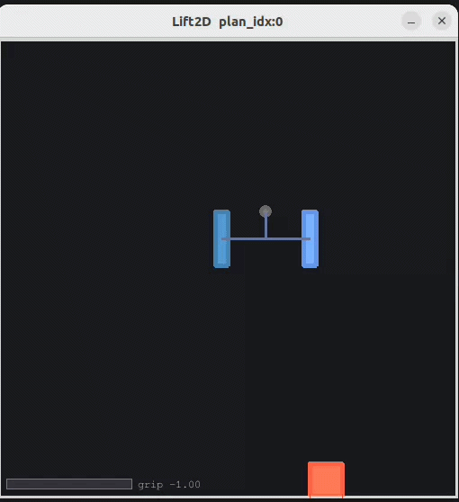

# RoboMimic2D

A lightweight 2D simulation benchmark for robot manipulation research, built on [Gymnasium](https://gymnasium.farama.org/).

RoboMimic2D provides fast-iteration 2D environments that mirror the task structure of [RoboMimic](https://robomimic.github.io/) — without the overhead of full 3D physics simulators. Built with **Pymunk** for rigid-body physics and **Pygame** for rendering, it enables rapid prototyping and evaluation of manipulation policy architectures (imitation learning, diffusion policies, reinforcement learning) in seconds rather than hours.

> **Status:** Active development. Policy learning baselines and pip-installable package coming soon.

<p align="center">
  
</p>

---

## Why 2D?

Training and evaluating manipulation policies in 3D simulators (MuJoCo, Isaac Sim) is slow — environment resets, rendering, and physics all add up. RoboMimic2D strips the problem to its core: **can your policy architecture learn contact-rich manipulation from demonstrations?**

This makes it ideal for:
- **Rapid architecture search** — test a new visual encoder or policy head in minutes, not hours
- **Debugging policy learning** — 2D state is easy to visualize end-to-end
- **Ablation studies** — isolate whether failures stem from perception, planning, or control
- **Benchmarking generalization** — lightweight domain randomization over object size, mass, and friction

## Environments

| Environment | Task | Observation Space | Action Space |
|---|---|---|---|
| **Lift2D** | Reach, grasp, and lift a block above a height threshold | `image` (3×96×96 float), `agent_pos` (2,) | Target x, target y, grip ∈ [-1, 1] |

*More environments (Push2D, Stack2D, PickPlace2D) in development.*

### Lift2D Details

The reward structure matches [RoboMimic's Lift task](https://robomimic.github.io/docs/datasets/robomimic_v0.1.html#lift): reward = 1.0 when the block is lifted above threshold, 0.0 otherwise.

**Physics:**
- Rigid-body dynamics via [Pymunk](http://www.pymunk.org/) (Chipmunk2D) with tuned solver iterations for stiff contact
- Parallel-jaw gripper modeled with kinematic fingers, velocity-motor drive, and force limits
- **Grip force is computed as:** `F = safety_factor × m×g / (2μ)`, where μ = finger_friction × block_friction (Pymunk's product rule). The gripper can only hold the block if friction forces balance gravity
- Grasp state machine: both fingers must stall against the block with grip closed → `grasped=True`. Grasp breaks on release
- Coefficients, solver parameters and constraints tuned for realistic contact behavior

All physics parameters are exposed via `Lift2DConfig`. This enables user to modify gravity, friction, block mass, gripper geometry, control frequency, etc. as per your use case.

## Quick Start

```bash
git clone https://github.com/sakshi79/robomimic2d.git
cd robomimic2d
pip install -r requirements.txt

# Interactive teleoperation
python -m envs2d.lift2d
```

**Controls:**
| Input | Action |
|---|---|
| Left-click drag | Move gripper toward cursor |
| Right-click / Space | Toggle gripper open/closed |
| Arrow keys | Move gripper (additive) |
| `R` | Reset episode |
| `Q` / Escape | Quit |

### Record Demonstrations

```bash
python -m envs2d.lift2d -o data/lift.zarr
```

Each completed episode is appended to the zarr replay buffer. Options: `--render-size` (default 96), `--window` (default 512).

### Gymnasium API

```python
from envs2d.lift2d.env import Lift2DEnv

env = Lift2DEnv()             # or Lift2DEnv(render_size=84, block_mass=2.0)
obs = env.reset()             # obs['image']: (3,96,96), obs['agent_pos']: (2,)

for step in range(1000):
    action = policy(obs)      # [target_x, target_y, grip]
    obs, reward, done, info = env.step(action)
    # info: pos_agent, vel_agent, block_pose, grasped, grip, n_contacts
```

### Replay Buffer

Demonstrations are stored in a zarr-backed `ReplayBuffer` supporting episodic storage, chunked compression, and efficient random access — compatible with standard imitation learning data pipelines (e.g., Diffusion Policy).

```python
from envs2d.replay_buffer import ReplayBuffer

buffer = ReplayBuffer.create_from_path("data/lift.zarr", mode="r")
print(f"{buffer.n_episodes} episodes, {buffer.n_steps} total steps")
episode = buffer.get_episode(0)  # dict of numpy arrays
```

## Architecture

```
envs2d/
├── lift2d/
│   ├── env.py          # Lift2DEnv (gymnasium.Env) — step, reset, obs, reward
│   ├── physics.py      # Pymunk space, walls, block, contact counting
│   ├── gripper.py      # Parallel-jaw gripper: kinematic base, finger motor, grasp state machine
│   ├── config.py       # Lift2DConfig — all tunable physics/rendering/control params
│   ├── render.py       # Pygame renderer (human + rgb_array modes)
│   ├── teleop.py       # Mouse/keyboard teleoperation controller
│   └── demo.py         # CLI entry point for interactive + recording
├── replay_buffer.py    # Zarr-backed episodic replay buffer with chunking/compression
└── pymunk_override.py  # Pymunk rendering utilities
```

## Roadmap

- [x] Lift2D environment with Pymunk rigid-body physics
- [x] Physics-based grip force computation (no cheating)
- [x] Gripper state machine with contact-based grasp detection
- [x] Interactive teleoperation with mouse/keyboard
- [x] Zarr replay buffer for demonstration recording
- [x] Gymnasium-compatible API
- [ ] Diffusion Policy and Behavior Cloning baselines
- [ ] Push2D, Stack2D, PickPlace2D environments
- [ ] pip-installable package (`pip install robomimic2d`)
- [ ] Domain randomization (object size, mass, friction)
- [ ] Gymnasium `register()` integration

## Tech Stack

**Physics:** Pymunk 6.2.1 (Chipmunk2D)  
**Rendering:** Pygame  
**Data:** NumPy, zarr (chunked, compressed episodic replay)  
**API:** Gymnasium 1.3.0  
**Designed for:** PyTorch policy learning (Diffusion Policy, BC, DQN)

## Related Work

This project is part of ongoing research on visual generalization for manipulation policies in the [Helping Hands Lab](https://www2.ccs.neu.edu/research/helpinghands/) at Northeastern University, advised by Dr. Robert Platt.

- [RoboMimic](https://robomimic.github.io/) — the 3D benchmark this project mirrors
- [Diffusion Policy](https://diffusion-policy.cs.columbia.edu/) — a key policy architecture we evaluate on these environments

## License

MIT

## Citation

```bibtex
@software{bhatia2025robomimic2d,
  author = {Bhatia, Sakshi},
  title = {RoboMimic2D: Lightweight 2D Manipulation Benchmarks for Policy Learning},
  year = {2025},
  url = {https://github.com/sakshi79/robomimic2d}
}
```